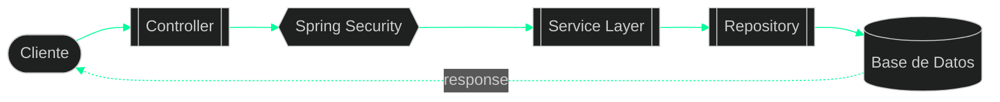

<div align="center">

```
╭──────────────────────────────────────────────╮
│  rodolfo@dev-machine:~$ whoami                │
╰──────────────────────────────────────────────╯
```


</div>

<br/>

```bash
$ cat perfil.txt
```

```yaml
nombre: Rodolfo Jara
rol: Software Developer
formacion: Ingeniería en Informática y Computación
enfoque: Backend · APIs REST · Microservicios
estado: Buscando nuevas oportunidades
```

<br/>

```bash
$ ls -la ./habilidades/
```

<table>
<tr>
<th align="left">📁 backend/</th>
<th align="left">📁 frontend/</th>
<th align="left">📁 database/</th>
<th align="left">📁 tools/</th>
</tr>
<tr valign="top">
<td>

`Java`
`Spring Boot`
`Spring MVC`
`Spring Security`
`Spring Data JPA`
`Hibernate`

</td>
<td>

`Angular`
`React`
`HTML5`
`CSS3`

</td>
<td>

`MySQL`
`SQL Server`
`JDBC`

</td>
<td>

`Git`
`GitHub`
`Azure`

</td>
</tr>
</table>

<br/>

```bash
$ ./run_arquitectura.sh --backend
```

<div align="center">


```mermaid
%%{init: {'theme':'dark', 'themeVariables': {'primaryColor':'#161b22','primaryBorderColor':'#00FF9C','primaryTextColor':'#00FF9C','lineColor':'#00FF9C','fontFamily':'monospace'}}}%%
flowchart LR
    REQ([Cliente]) --> CTRL[["Controller"]]
    CTRL --> SEC{{"Spring Security"}}
    SEC --> SVC[["Service Layer"]]
    SVC --> REPO[["Repository"]]
    REPO --> DB[(Base de Datos)]
    DB -.response.-> REQ
```

`>> Request → Controller → Security → Service → Repository → DB`

</div>

<br/>

```bash
$ git log --oneline --author="Rodolfo Jara" -3
```

<div align="center">

<a href="https://github.com/Rodolfo-Jara/ProyectoSistemaDeCalificaciones">
  
</a>

</div>

```bash
$ curl -s api.github.com/users/rodolfo-jara/stats
```

<div align="center">


</div>

<br/>

```bash
$ cat contacto.json
```

```json
{
  "email": "rjaralopez19@gmail.com",
  "portfolio": "https://rodolfo-jara.github.io/_/Pagina/index.html",
  "github": "github.com/Rodolfo-Jara",
  "disponible": true
}
```

<br/>

<div align="center">

`rodolfo@dev-machine:~$ ` 

</div>
