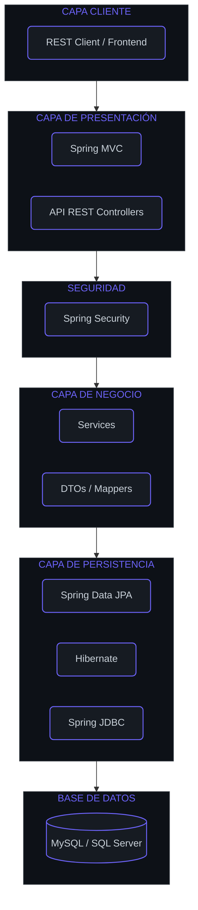

 

 

 

## `01` Perfil

> Recién graduado en **Informática y Computación**, especializado en desarrollo backend con **Java Spring Boot** y arquitectura de microservicios. Enfocado en escribir código limpio, mantenible y en resolver problemas reales con soluciones eficientes.

| | |
|---|---|
| 🎓 **Formación** | Ingeniería en Informática y Computación |
| 💼 **Enfoque** | Desarrollo Backend · APIs REST · Microservicios |
| 🌱 **Aprendiendo** | Buenas prácticas de arquitectura escalable |
| 🎯 **Buscando** | Oportunidades para aportar y seguir creciendo |

 

## `02` Stack Tecnológico

<table align="center">
<tr>
<td align="center" width="140">
 <b>Java</b>
</td>
<td align="center" width="140">
 <b>Spring Boot</b>
</td>
<td align="center" width="140">
 <b>MySQL</b>
</td>
<td align="center" width="140">
 <b>SQL Server</b>
</td>
</tr>
<tr>
<td align="center">
 <b>Angular</b>
</td>
<td align="center">
 <b>React</b>
</td>
<td align="center">
 <b>Git</b>
</td>
<td align="center">
 <b>Azure</b>
</td>
</tr>
</table>

 

## `03` Arquitectura Backend

```mermaid
flowchart TB
    subgraph CLIENT[" CAPA CLIENTE "]
        direction LR
        C1[REST Client / Frontend]
    end

    subgraph PRESENTATION[" CAPA DE PRESENTACIÓN "]
        direction LR
        P1[Spring MVC]
        P2[API REST Controllers]
    end

    subgraph SECURITY[" SEGURIDAD "]
        direction LR
        S1[Spring Security]
    end

    subgraph BUSINESS[" CAPA DE NEGOCIO "]
        direction LR
        B1[Services]
        B2[DTOs / Mappers]
    end

    subgraph PERSISTENCE[" CAPA DE PERSISTENCIA "]
        direction LR
        D1[Spring Data JPA]
        D2[Hibernate]
        D3[Spring JDBC]
    end

    subgraph DATABASE[" BASE DE DATOS "]
        direction LR
        DB[(MySQL / SQL Server)]
    end

    CLIENT --> PRESENTATION
    PRESENTATION --> SECURITY
    SECURITY --> BUSINESS
    BUSINESS --> PERSISTENCE
    PERSISTENCE --> DATABASE

    classDef default fill:#161b22,stroke:#6C63FF,color:#c9d1d9,stroke-width:1.5px,rx:6,ry:6;
    classDef sub fill:#0d1117,stroke:#30363d,color:#6C63FF,stroke-width:1px;
    class CLIENT,PRESENTATION,SECURITY,BUSINESS,PERSISTENCE,DATABASE sub;
```

Flujo de una petición: <b>Cliente → Controller → Security → Service → Repository → Base de Datos</b>

 

## `04` Proyecto Destacado

Sistema de gestión de calificaciones · Java · Arquitectura en capas

 

## `05` Estadísticas

 

 

## `06` Contacto

📧 **rjaralopez19@gmail.com** &nbsp;·&nbsp; 🌐 [rodolfo-jara.github.io](https://rodolfo-jara.github.io/_/Pagina/index.html)

 

