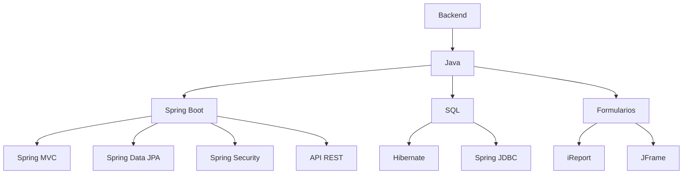

 

  

 

## 👋 Sobre mí

Recién graduado en **Informática y Computación**, apasionado por el desarrollo de software y la resolución creativa de problemas. Cuento con experiencia destacada en el diseño y desarrollo de proyectos académicos utilizando **Java Spring Boot** y **arquitectura de microservicios**.

Actualmente busco oportunidades donde pueda aplicar y ampliar mis habilidades, aportando soluciones eficientes e innovadoras a proyectos de desarrollo de software.

- 🔭 Trabajando actualmente en proyectos backend con **Java & Spring Boot**
- 🌱 Profundizando en **arquitectura de microservicios** y buenas prácticas de API REST
- 👯 Abierto a colaborar en proyectos open source
- 💬 Puedes preguntarme sobre **Java, Spring Boot, SQL o desarrollo web**
- 📫 Contacto: **rjaralopez19@gmail.com**
- ⚡ Fun fact: me encanta convertir problemas complejos en soluciones simples

 

## 🛠️ Stack Tecnológico

### Backend
&nbsp;
&nbsp;
&nbsp;
&nbsp;

### Frontend
&nbsp;
&nbsp;
&nbsp;

### Herramientas
&nbsp;

 

## 🏗️ Arquitectura Backend

```mermaid
graph TD;
    A[Backend] --> B[Java];
    B --> C[Spring Boot];
    C --> D[Spring MVC];
    C --> E[Spring Data JPA];
    C --> F[Spring Security];
    C --> G[API REST];
    B --> H[SQL];
    H --> I[Hibernate];
    H --> J[Spring JDBC];
    B --> K[Formularios];
    K --> L[iReport];
    K --> M[JFrame];
```

 

## 🚀 Proyectos Destacados

 

## 📊 Estadísticas de GitHub

  
  

  

 

## 📫 Contáctame

