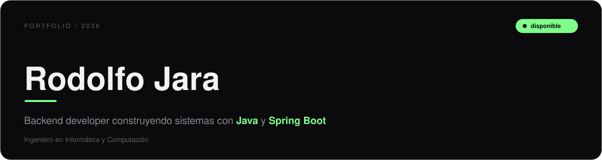

  

&nbsp;

 

 

<table align="center" width="100%">
<tr>
<td align="center" width="33%">

**4+**
 
años estudiando

</td>
<td align="center" width="33%">

**Java**
 
stack principal

</td>
<td align="center" width="33%">

**Open**
 
a oportunidades

</td>
</tr>
</table>

 

 

### Arquitectura

<table>
<tr><td width="36"></td><td>Controller recibe la petición REST</td></tr>
<tr><td></td><td>Spring Security valida el acceso</td></tr>
<tr><td></td><td>Service ejecuta la lógica de negocio</td></tr>
<tr><td></td><td>Repository persiste vía JPA / Hibernate</td></tr>
</table>

 

 

### Stack

  

 

### Proyecto destacado

 

 

### Estadísticas

  

 

rjaralopez19@gmail.com&nbsp;&nbsp;·&nbsp;&nbsp;<a href="https://rodolfo-jara.github.io/_/Pagina/index.html">rodolfo-jara.github.io</a>&nbsp;&nbsp;·&nbsp;&nbsp;<a href="https://github.com/Rodolfo-Jara">github.com/Rodolfo-Jara</a>

 
