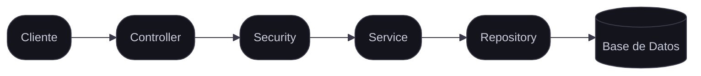

 

 

<h1 align="center" style="font-weight:200; letter-spacing:8px; color:#e8e8f0;">RODOLFO&nbsp;JARA</h1>

&nbsp;&nbsp;&nbsp;&nbsp;S O F T W A R E &nbsp; D E V E L O P E R&nbsp;&nbsp;&nbsp;&nbsp;

  

  

&nbsp;&nbsp;

 

 

### Perfil

Ingeniero en Informática y Computación, enfocado en el desarrollo backend con Java y Spring Boot. Diseño soluciones con arquitectura de microservicios, priorizando código limpio y eficiente.

  

### Stack

 

  

  

  

 

### Arquitectura

 

```mermaid
%%{init: {'theme':'base', 'themeVariables': {
  'primaryColor':'#14141c',
  'primaryBorderColor':'#3a3a4a',
  'primaryTextColor':'#c9cddb',
  'lineColor':'#3a3a4a',
  'fontFamily':'Inter, sans-serif',
  'fontSize':'13px'
}}}%%
flowchart LR
    A(Cliente) --> B(Controller)
    B --> C(Security)
    C --> D(Service)
    D --> E(Repository)
    E --> F[(Base de Datos)]

    style A fill:#14141c,stroke:#3a3a4a,rx:20,ry:20
    style B fill:#14141c,stroke:#3a3a4a,rx:20,ry:20
    style C fill:#14141c,stroke:#3a3a4a,rx:20,ry:20
    style D fill:#14141c,stroke:#3a3a4a,rx:20,ry:20
    style E fill:#14141c,stroke:#3a3a4a,rx:20,ry:20
    style F fill:#14141c,stroke:#3a3a4a,rx:8,ry:8
```

Flujo de una petición a través de las capas de la aplicación

  

 

### Proyecto

 

  

 

### Estadísticas

 

  

 

rjaralopez19@gmail.com&nbsp;&nbsp;·&nbsp;&nbsp;<a href="https://rodolfo-jara.github.io/_/Pagina/index.html">rodolfo-jara.github.io</a>&nbsp;&nbsp;·&nbsp;&nbsp;<a href="https://github.com/Rodolfo-Jara">github.com/Rodolfo-Jara</a>

  

